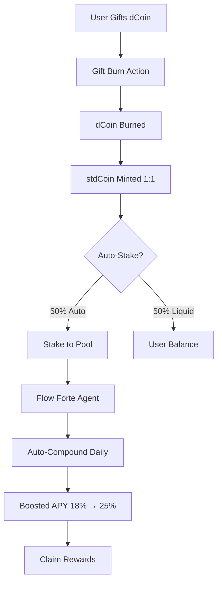

# dBattle - Decentralized Battle Streaming Platform

A livestreaming battle platform built on Flow blockchain where creators compete in real-time battles and viewers support them with token gifts.

## 🎯 Features

- **Flow Blockchain Integration**: Connect Flow wallet using FCL (Flow Client Library)
- **Token System**: dBattle Token (DBT) on Flow contract `0x7bb1b058bf341d24`
- **Live Battles**: Real-time streaming battles with gift-based scoring
- **Token Economy**: Claim, gift, and stake DBT tokens
- **Profile Management**: Track earnings, battles, and achievements

## 🔧 Tech Stack

- **Frontend**: React + TypeScript + Vite
- **Styling**: Tailwind CSS
- **Blockchain**: Flow (using @onflow/fcl)
- **Backend**: Supabase
- **Database**: PostgreSQL
- **Real-time**: Supabase Realtime

## 📦 Installation

```bash
# Install dependencies
npm install

# Start development server
npm run dev
```

## 🔗 Flow Token Integration

### Contract Address
- **Token Contract**: `0x7bb1b058bf341d24`
- **Network**: Flow Mainnet

### Integration Code

#### 1. Flow Configuration (`src/lib/flow.ts`)
```typescript
import * as fcl from "@onflow/fcl";

fcl.config()
  .put("app.detail.title", "dBattle")
  .put("app.detail.icon", "https://dbattle.com/icon.png")
  .put("flow.network", "mainnet")
  .put("accessNode.api", "https://access-mainnet.onflow.org")
  .put("discovery.wallet", "https://fcl-discovery.onflow.org/authn")
  .put("discovery.wallet.method.default", "IFRAME/RPC");

export { fcl };
```

#### 2. Token Utilities (`src/lib/flowToken.ts`)
```typescript
import * as fcl from "@onflow/fcl";

export const TOKEN_CONTRACT_ADDRESS = "0x7bb1b058bf341d24";

// Get token balance
export async function getTokenBalance(address: string): Promise<number> {
  const script = `
    import FungibleToken from 0xf233dcee88fe0abe
    import DBattleToken from ${TOKEN_CONTRACT_ADDRESS}

    pub fun main(address: Address): UFix64 {
      let account = getAccount(address)
      let vaultRef = account.getCapability(/public/DBattleTokenBalance)
        .borrow<&DBattleToken.Vault{FungibleToken.Balance}>()
        ?? panic("Could not borrow balance reference")
      
      return vaultRef.balance
    }
  `;

  const balance = await fcl.query({
    cadence: script,
    args: (arg: any, t: any) => [arg(address, t.Address)],
  });
  
  return parseFloat(balance);
}

// Transfer tokens
export async function transferTokens(amount: number, recipient: string): Promise<string> {
  const transaction = `
    import FungibleToken from 0xf233dcee88fe0abe
    import DBattleToken from ${TOKEN_CONTRACT_ADDRESS}

    transaction(amount: UFix64, recipient: Address) {
      let sentVault: @FungibleToken.Vault
      
      prepare(signer: AuthAccount) {
        let vaultRef = signer.borrow<&DBattleToken.Vault>(from: /storage/DBattleTokenVault)
          ?? panic("Could not borrow reference to the owner's Vault")
        
        self.sentVault <- vaultRef.withdraw(amount: amount)
      }
      
      execute {
        let receiverRef = getAccount(recipient)
          .getCapability(/public/DBattleTokenReceiver)
          .borrow<&{FungibleToken.Receiver}>()
          ?? panic("Could not borrow receiver reference")
        
        receiverRef.deposit(from: <-self.sentVault)
      }
    }
  `;

  const txId = await fcl.mutate({
    cadence: transaction,
    args: (arg: any, t: any) => [
      arg(amount.toFixed(8), t.UFix64),
      arg(recipient, t.Address),
    ],
    limit: 9999,
  });

  await fcl.tx(txId).onceSealed();
  return txId;
}
```

#### 3. React Hook (`src/hooks/useFlowUser.ts`)
```typescript
import { useEffect, useState } from "react";
import { fcl } from "@/lib/flow";

export type FlowUser = {
  addr?: string | null;
  loggedIn?: boolean | null;
};

export function useFlowUser() {
  const [user, setUser] = useState<FlowUser>({ loggedIn: null, addr: undefined });

  useEffect(() => {
    return fcl.currentUser.subscribe(setUser);
  }, []);

  const logIn = () => fcl.authenticate();
  const logOut = () => fcl.unauthenticate();

  return { user, logIn, logOut };
}
```

#### 4. Token Balance Hook (`src/hooks/useTokenBalance.ts`)
```typescript
import { useEffect, useState } from "react";
import { supabase } from "@/integrations/supabase/client";
import { useFlowUser } from "./useFlowUser";

export function useTokenBalance() {
  const { user } = useFlowUser();
  const [balance, setBalance] = useState<number>(0);
  const [loading, setLoading] = useState(false);

  const fetchBalance = async () => {
    if (!user.loggedIn) return;
    
    const { data } = await supabase.functions.invoke("get-token-balance");
    setBalance(data?.balance || 0);
  };

  const claimTokens = async () => {
    if (!user.addr) return false;
    
    const { data } = await supabase.functions.invoke("claim-tokens", {
      body: { flow_address: user.addr },
    });
    
    setBalance(data.total_balance);
    return true;
  };

  useEffect(() => {
    fetchBalance();
    
    // Real-time balance updates
    const channel = supabase
      .channel("profile-changes")
      .on("postgres_changes", { event: "*", schema: "public", table: "profiles" }, fetchBalance)
      .subscribe();

    return () => { supabase.removeChannel(channel); };
  }, [user.loggedIn]);

  return { balance, loading, claimTokens, fetchBalance };
}
```

## 📹 Real-Time Livestreaming Implementation

The platform uses **WebRTC** (Web Real-Time Communication) for seamless live streaming without requiring external API keys or services.

### How It Works

#### Frontend Components

**1. LiveStreamView Component** (`src/components/LiveStreamView.tsx`)
- Manages live video stream using browser MediaStream API
- Accesses user's camera and microphone via `navigator.mediaDevices.getUserMedia()`
- Provides real-time controls for video/audio toggle
- Displays live badge and stream status
- Handles stream cleanup on unmount

**2. GoLiveDialog Component** (`src/components/GoLiveDialog.tsx`)
- Workflow: Enter title → Create livestream → Start camera → Go live
- Integrates with backend to create livestream record
- Opens full-screen streaming view with controls
- Provides end stream functionality

#### Backend Flow

```
1. Creator clicks "Go Live" button
2. Frontend calls `create-livestream` edge function
3. Backend creates livestream record with status='live'
4. WebRTC accesses creator's camera/microphone
5. Stream appears on feed via Supabase Realtime
6. Viewers watch live stream in real-time
7. Creator clicks "End Stream"
8. Frontend calls `update-livestream-status` with status='ended'
```

### WebRTC Implementation

```typescript
// Access user media (no API keys needed)
const stream = await navigator.mediaDevices.getUserMedia({
  video: { width: 1280, height: 720 },
  audio: true
});

// Display stream locally
videoRef.current.srcObject = stream;

// Toggle video/audio tracks
videoTrack.enabled = !videoTrack.enabled;
audioTrack.enabled = !audioTrack.enabled;

// Stop stream when done
stream.getTracks().forEach(track => track.stop());
```

### Real-Time Feed Integration

- Livestreams automatically appear on the main feed
- Uses Supabase Realtime for instant updates
- Status changes (live/ended) reflected immediately
- No manual refresh required

## 🔐 Backend Functions

### Database Schema

```sql
-- Profiles table
CREATE TABLE profiles (
  id UUID PRIMARY KEY DEFAULT gen_random_uuid(),
  user_id UUID REFERENCES auth.users NOT NULL,
  username TEXT NOT NULL,
  avatar_url TEXT,
  dcoin_balance INTEGER DEFAULT 1000,
  flow_address TEXT,
  created_at TIMESTAMPTZ DEFAULT now(),
  updated_at TIMESTAMPTZ DEFAULT now()
);

-- Livestreams table
CREATE TABLE livestreams (
  id UUID PRIMARY KEY DEFAULT gen_random_uuid(),
  creator_id UUID REFERENCES auth.users NOT NULL,
  collaborator_id UUID REFERENCES auth.users,
  title TEXT NOT NULL,
  description TEXT,
  status TEXT DEFAULT 'pending',
  current_round INTEGER DEFAULT 1,
  started_at TIMESTAMPTZ,
  ended_at TIMESTAMPTZ,
  created_at TIMESTAMPTZ DEFAULT now()
);

-- Livestream rounds table
CREATE TABLE livestream_rounds (
  id UUID PRIMARY KEY DEFAULT gen_random_uuid(),
  livestream_id UUID REFERENCES livestreams NOT NULL,
  round_number INTEGER NOT NULL,
  creator_score INTEGER DEFAULT 0,
  collaborator_score INTEGER DEFAULT 0,
  winner_id UUID,
  milestone INTEGER DEFAULT 1000,
  status TEXT DEFAULT 'active',
  started_at TIMESTAMPTZ DEFAULT now(),
  ended_at TIMESTAMPTZ
);

-- Livestream gifts table
CREATE TABLE livestream_gifts (
  id UUID PRIMARY KEY DEFAULT gen_random_uuid(),
  livestream_id UUID REFERENCES livestreams NOT NULL,
  round_id UUID REFERENCES livestream_rounds NOT NULL,
  from_user_id UUID REFERENCES auth.users NOT NULL,
  to_creator_id UUID REFERENCES auth.users NOT NULL,
  gift_type TEXT NOT NULL,
  amount INTEGER NOT NULL,
  created_at TIMESTAMPTZ DEFAULT now()
);
```

### Edge Functions

#### 1. Create Livestream (`supabase/functions/create-livestream/index.ts`)

**Purpose**: Initialize a new livestream battle session

```typescript
// Request body
{
  title: string;
  description?: string;
  collaborator_id?: string;
}

// Response
{
  success: boolean;
  livestream: {
    id: string;
    creator_id: string;
    title: string;
    status: 'live';
    started_at: string;
  }
}
```

**Implementation**:
- Authenticates user via JWT token
- Creates livestream record in database
- Initializes first round with milestone (1000 points)
- Returns livestream data for frontend streaming

**Usage**:
```typescript
const { data } = await supabase.functions.invoke('create-livestream', {
  body: { title: "Epic Battle!", description: "Let's go!" }
});
```

#### 2. Update Livestream Status (`supabase/functions/update-livestream-status/index.ts`)

**Purpose**: Change livestream status (end stream, update state)

```typescript
// Request body
{
  livestream_id: string;
  status: 'live' | 'ended';
}

// Response
{
  success: boolean;
  livestream: LivestreamObject;
}
```

**Implementation**:
- Verifies user owns the livestream
- Updates status and ended_at timestamp
- Closes all active rounds if ending stream
- Returns updated livestream object

**Usage**:
```typescript
const { data } = await supabase.functions.invoke('update-livestream-status', {
  body: { livestream_id: "uuid", status: "ended" }
});
```

#### 3. Get Livestreams (`supabase/functions/get-livestreams/index.ts`)

**Purpose**: Fetch all active livestreams for the feed

**Response**:
```typescript
{
  livestreams: Array<{
    id: string;
    title: string;
    creator_id: string;
    status: 'live';
    viewer_count: number;
    started_at: string;
  }>
}
```

**Usage**:
```typescript
const { data } = await supabase.functions.invoke('get-livestreams');
```

#### 4. Claim Tokens (`supabase/functions/claim-tokens/index.ts`)

**Purpose**: Award initial tokens when users connect their Flow wallet

```typescript
import { serve } from "https://deno.land/std@0.168.0/http/server.ts";
import { createClient } from "https://esm.sh/@supabase/supabase-js@2";

serve(async (req) => {
  const supabase = createClient(
    Deno.env.get("SUPABASE_URL")!,
    Deno.env.get("SUPABASE_SERVICE_ROLE_KEY")!
  );

  const { data: { user } } = await supabase.auth.getUser(
    req.headers.get("Authorization")!.replace("Bearer ", "")
  );

  const { flow_address } = await req.json();

  // Check if user already has profile
  const { data: profile } = await supabase
    .from("profiles")
    .select("*")
    .eq("user_id", user.id)
    .single();

  if (!profile) {
    // Create profile with initial 1000 tokens
    await supabase.from("profiles").insert({
      user_id: user.id,
      username: user.email?.split("@")[0] || "user",
      dcoin_balance: 1000,
      flow_address: flow_address,
    });

    return new Response(
      JSON.stringify({ 
        success: true, 
        tokens_claimed: 1000, 
        total_balance: 1000 
      })
    );
  }

  return new Response(
    JSON.stringify({ 
      success: true, 
      tokens_claimed: 0, 
      total_balance: profile.dcoin_balance 
    })
  );
});
```

**Usage**:
```typescript
const { data } = await supabase.functions.invoke("claim-tokens", {
  body: { flow_address: userFlowAddress }
});
```

#### 5. Get Token Balance (`supabase/functions/get-token-balance/index.ts`)

**Purpose**: Retrieve user's current DBT token balance

```typescript
import { serve } from "https://deno.land/std@0.168.0/http/server.ts";
import { createClient } from "https://esm.sh/@supabase/supabase-js@2";

serve(async (req) => {
  const supabase = createClient(
    Deno.env.get("SUPABASE_URL")!,
    Deno.env.get("SUPABASE_SERVICE_ROLE_KEY")!
  );

  const { data: { user } } = await supabase.auth.getUser(
    req.headers.get("Authorization")!.replace("Bearer ", "")
  );

  const { data: profile } = await supabase
    .from("profiles")
    .select("dcoin_balance, flow_address")
    .eq("user_id", user.id)
    .single();

  return new Response(
    JSON.stringify({
      balance: profile?.dcoin_balance || 0,
      flow_address: profile?.flow_address
    })
  );
});
```

**Usage**:
```typescript
const { data } = await supabase.functions.invoke("get-token-balance");
console.log(data.balance); // Current DBT balance
```

#### 6. Send Gift (`supabase/functions/send-gift/index.ts`)

**Purpose**: Process gift transactions during livestreams, deduct tokens, update scores

```typescript
import { serve } from "https://deno.land/std@0.168.0/http/server.ts";
import { createClient } from "https://esm.sh/@supabase/supabase-js@2";

serve(async (req) => {
  const supabase = createClient(
    Deno.env.get("SUPABASE_URL")!,
    Deno.env.get("SUPABASE_SERVICE_ROLE_KEY")!
  );

  const { data: { user } } = await supabase.auth.getUser(
    req.headers.get("Authorization")!.replace("Bearer ", "")
  );

  const { livestream_id, to_creator_id, amount, gift_type } = await req.json();

  // Get user's balance
  const { data: profile } = await supabase
    .from("profiles")
    .select("dcoin_balance")
    .eq("user_id", user.id)
    .single();

  if (profile.dcoin_balance < amount) {
    return new Response(
      JSON.stringify({ error: "Insufficient balance" }),
      { status: 400 }
    );
  }

  // Deduct tokens from sender
  await supabase
    .from("profiles")
    .update({ dcoin_balance: profile.dcoin_balance - amount })
    .eq("user_id", user.id);

  // Get active round
  const { data: round } = await supabase
    .from("livestream_rounds")
    .select("*")
    .eq("livestream_id", livestream_id)
    .eq("status", "active")
    .single();

  // Record gift
  await supabase.from("livestream_gifts").insert({
    livestream_id,
    round_id: round.id,
    from_user_id: user.id,
    to_creator_id,
    gift_type,
    amount,
  });

  // Update score
  const { data: livestream } = await supabase
    .from("livestreams")
    .select("creator_id")
    .eq("id", livestream_id)
    .single();

  const isCreator = to_creator_id === livestream.creator_id;
  const newScore = isCreator 
    ? round.creator_score + amount
    : round.collaborator_score + amount;

  await supabase
    .from("livestream_rounds")
    .update({
      [isCreator ? "creator_score" : "collaborator_score"]: newScore
    })
    .eq("id", round.id);

  // Check milestone
  const milestone_reached = newScore >= round.milestone;

  return new Response(
    JSON.stringify({ 
      success: true, 
      milestone_reached,
      new_round: milestone_reached ? round.round_number + 1 : round.round_number
    })
  );
});
```

**Usage**:
```typescript
const { data } = await supabase.functions.invoke("send-gift", {
  body: {
    livestream_id: "uuid",
    to_creator_id: "uuid",
    amount: 100,
    gift_type: "Lion"
  }
});
```

## 🏗️ Backend Architecture

```
supabase/
├── functions/
│   ├── create-livestream/
│   │   └── index.ts          # Initialize new battle stream
│   ├── update-livestream-status/
│   │   └── index.ts          # Update livestream state (end stream)
│   ├── get-livestreams/
│   │   └── index.ts          # Fetch active livestreams
│   ├── claim-tokens/
│   │   └── index.ts          # Award initial tokens on wallet connection
│   ├── get-token-balance/
│   │   └── index.ts          # Fetch user's DBT balance
│   └── send-gift/
│       └── index.ts          # Process gift transactions
├── migrations/
│   └── [timestamp]_*.sql     # Database schema changes
└── config.toml               # Function configurations

Database Tables:
├── profiles              # User profiles & token balances
├── livestreams          # Active/past livestream battles
├── livestream_rounds    # Round-by-round battle data
└── livestream_gifts     # Gift transaction history
```

## 🔄 Token Flow

1. **Connect Wallet** → User authenticates with Flow wallet via FCL
2. **Claim Tokens** → `claim-tokens` awards 1000 DBT on first connection
3. **View Balance** → `get-token-balance` displays current DBT holdings
4. **Gift Tokens** → `send-gift` deducts DBT, updates recipient score
5. **Earn Tokens** → Creators earn DBT from gifts received during battles
6. **Profile Display** → Token balance shown on profile page

## 🚀 Deployment

```bash
# Build for production
npm run build

# Preview production build
npm run preview
```

## 📝 Environment Variables

```env
VITE_SUPABASE_URL=your_supabase_url
VITE_SUPABASE_PUBLISHABLE_KEY=your_publishable_key
VITE_SUPABASE_PROJECT_ID=your_project_id
```

## 🤝 Contributing

1. Fork the repository
2. Create your feature branch (`git checkout -b feature/amazing-feature`)
3. Commit your changes (`git commit -m 'Add amazing feature'`)
4. Push to the branch (`git push origin feature/amazing-feature`)
5. Open a Pull Request

## 📄 License

MIT License - see LICENSE file for details

## 💰 Flow Forte Staking Integration

dBattle integrates **Flow Forte** for automated staking, compounding, and yield optimization. Flow Forte enables perpetual payouts and agent-based automation for passive stdCoin yields.

### Architecture Overview



### Token Economics

- **dCoin**: Base token for gifting creators during battles
- **stdCoin**: Staking derivative token earned from:
  - Burning dCoin (1:1 ratio)
  - Staking rewards
  - Auto-compounding yields

### Staking Pools

| Pool | Base APY | Boosted APY | Duration | Min Stake | Frequency |
|------|----------|-------------|----------|-----------|-----------|
| Battle Legends | 18% | 25% | 30 days | 100 dCoin | Daily |
| Creator Support | 15% | 22% | 14 days | 50 dCoin | Weekly |
| Community Growth | 20% | 28% | 90 days | 500 dCoin | Daily |

**Boosted APY** achieved through Flow Forte auto-compounding.

### Integration Code

#### 1. Frontend Staking Hook (`src/hooks/useStaking.ts`)

```typescript
import { useState, useEffect } from "react";
import { supabase } from "@/integrations/supabase/client";

export function useStaking() {
  const [pools, setPools] = useState([]);
  const [totalRewards, setTotalRewards] = useState(0);
  const [loading, setLoading] = useState(false);

  const fetchStakingData = async () => {
    const { data } = await supabase.functions.invoke("get-staking-data");
    setPools(data.pools);
    setTotalRewards(data.total_rewards);
  };

  const stakeTokens = async (poolId: string, amount: number) => {
    const { data, error } = await supabase.functions.invoke("stake-tokens", {
      body: { pool_id: poolId, amount },
    });
    if (!error) {
      toast({ title: "Staking Successful!", description: data.message });
      fetchStakingData();
    }
  };

  const claimRewards = async () => {
    const { data } = await supabase.functions.invoke("claim-rewards");
    toast({ title: "Rewards Claimed!", description: `${data.amount} stdCoin` });
  };

  useEffect(() => {
    fetchStakingData();
    
    // Real-time updates
    const channel = supabase
      .channel("staking-changes")
      .on("postgres_changes", { event: "*", schema: "public", table: "user_stakes" }, fetchStakingData)
      .subscribe();

    return () => { supabase.removeChannel(channel); };
  }, []);

  return { pools, totalRewards, loading, stakeTokens, claimRewards };
}
```

#### 2. Stake Tokens Function (`supabase/functions/stake-tokens/index.ts`)

```typescript
import { createClient } from "https://esm.sh/@supabase/supabase-js@2";

serve(async (req) => {
  const supabase = createClient(
    Deno.env.get("SUPABASE_URL")!,
    Deno.env.get("SUPABASE_SERVICE_ROLE_KEY")!
  );

  const { data: { user } } = await supabase.auth.getUser(
    req.headers.get("Authorization")!.replace("Bearer ", "")
  );

  const { pool_id, amount } = await req.json();

  // Validate balance
  const { data: profile } = await supabase
    .from("profiles")
    .select("dcoin_balance")
    .eq("user_id", user.id)
    .single();

  if (profile.dcoin_balance < amount) {
    throw new Error("Insufficient dCoin balance");
  }

  // Get pool details
  const { data: pool } = await supabase
    .from("staking_pools")
    .select("*")
    .eq("id", pool_id)
    .single();

  // Deduct dCoin
  await supabase
    .from("profiles")
    .update({ dcoin_balance: profile.dcoin_balance - amount })
    .eq("user_id", user.id);

  // Create stake
  const unlock_at = new Date();
  unlock_at.setDate(unlock_at.getDate() + pool.duration_days);

  const { data: stake } = await supabase
    .from("user_stakes")
    .insert({
      user_id: user.id,
      pool_id,
      amount,
      unlock_at: unlock_at.toISOString(),
      auto_compound: true,
    })
    .select()
    .single();

  // Schedule Flow Forte auto-compound
  const nextCompound = new Date();
  nextCompound.setDate(nextCompound.getDate() + 1); // Daily

  await supabase.from("compound_schedule").insert({
    stake_id: stake.id,
    user_id: user.id,
    next_compound_at: nextCompound.toISOString(),
    frequency: 'daily',
    status: 'active',
  });

  return new Response(JSON.stringify({ success: true, stake }));
});
```

#### 3. Auto-Compound Function (`supabase/functions/auto-compound/index.ts`)

This function is triggered by **Flow Forte** on a schedule (daily/weekly).

```typescript
import { createClient } from "https://esm.sh/@supabase/supabase-js@2";

serve(async (req) => {
  const supabase = createClient(
    Deno.env.get("SUPABASE_URL")!,
    Deno.env.get("SUPABASE_SERVICE_ROLE_KEY")!
  );

  // Get all due compound schedules
  const now = new Date().toISOString();
  const { data: schedules } = await supabase
    .from("compound_schedule")
    .select(`
      *,
      user_stakes!inner(id, amount, pool_id, user_id, staking_pools!inner(boosted_apy))
    `)
    .eq("status", "active")
    .lte("next_compound_at", now);

  for (const schedule of schedules || []) {
    const stake = schedule.user_stakes;
    const pool = stake.staking_pools;
    
    // Calculate rewards (boosted APY with auto-compound)
    const dailyRate = pool.boosted_apy / 100 / 365;
    const rewardAmount = stake.amount * dailyRate;

    // Create reward
    await supabase.from("staking_rewards").insert({
      stake_id: stake.id,
      user_id: stake.user_id,
      amount: rewardAmount,
      reward_type: 'compound',
      claimed: false,
    });

    // Add to stdCoin balance
    const { data: profile } = await supabase
      .from("profiles")
      .select("stdcoin_balance")
      .eq("user_id", stake.user_id)
      .single();

    await supabase
      .from("profiles")
      .update({ stdcoin_balance: profile.stdcoin_balance + rewardAmount })
      .eq("user_id", stake.user_id);

    // Update next compound time
    const nextCompound = new Date();
    nextCompound.setDate(nextCompound.getDate() + 1);

    await supabase
      .from("compound_schedule")
      .update({
        next_compound_at: nextCompound.toISOString(),
        last_compound_at: now,
        total_compounds: schedule.total_compounds + 1,
      })
      .eq("id", schedule.id);
  }

  return new Response(JSON.stringify({ 
    success: true, 
    compounded: schedules?.length 
  }));
});
```

#### 4. Gift Burn → Mint → Stake Chain (`supabase/functions/process-gift-burn/index.ts`)

```typescript
import { createClient } from "https://esm.sh/@supabase/supabase-js@2";

serve(async (req) => {
  const supabase = createClient(
    Deno.env.get("SUPABASE_URL")!,
    Deno.env.get("SUPABASE_SERVICE_ROLE_KEY")!
  );

  const { data: { user } } = await supabase.auth.getUser(
    req.headers.get("Authorization")!.replace("Bearer ", "")
  );

  const { gift_id, dcoin_amount, auto_stake_percent = 50 } = await req.json();

  // STEP 1: Burn dCoin
  console.log(`Burning ${dcoin_amount} dCoin`);

  // STEP 2: Mint stdCoin (1:1)
  const stdcoin_minted = dcoin_amount;

  // STEP 3: Split for auto-stake
  const auto_stake_amount = stdcoin_minted * (auto_stake_percent / 100);
  const liquid_amount = stdcoin_minted - auto_stake_amount;

  // Add liquid portion to balance
  const { data: profile } = await supabase
    .from("profiles")
    .select("stdcoin_balance")
    .eq("user_id", user.id)
    .single();

  await supabase
    .from("profiles")
    .update({ stdcoin_balance: profile.stdcoin_balance + liquid_amount })
    .eq("user_id", user.id);

  // STEP 4: Auto-stake 50%
  let stake_id = null;
  if (auto_stake_amount > 0) {
    const { data: pool } = await supabase
      .from("staking_pools")
      .select("*")
      .eq("name", "Battle Legends")
      .single();

    if (pool && auto_stake_amount >= pool.min_stake) {
      const unlock_at = new Date();
      unlock_at.setDate(unlock_at.getDate() + pool.duration_days);

      const { data: stake } = await supabase
        .from("user_stakes")
        .insert({
          user_id: user.id,
          pool_id: pool.id,
          amount: auto_stake_amount,
          unlock_at: unlock_at.toISOString(),
          auto_compound: true,
        })
        .select()
        .single();

      stake_id = stake.id;

      // STEP 5: Trigger Flow Forte Agent
      const nextCompound = new Date();
      nextCompound.setDate(nextCompound.getDate() + 1);

      await supabase.from("compound_schedule").insert({
        stake_id: stake.id,
        user_id: user.id,
        next_compound_at: nextCompound.toISOString(),
        frequency: 'daily',
        status: 'active',
      });
    }
  }

  // Log the action chain
  await supabase.from("gift_burn_log").insert({
    gift_id,
    user_id: user.id,
    dcoin_burned: dcoin_amount,
    stdcoin_minted,
    auto_staked: auto_stake_amount > 0,
    stake_id,
  });

  return new Response(JSON.stringify({ 
    success: true,
    dcoin_burned: dcoin_amount,
    stdcoin_minted,
    auto_staked: auto_stake_amount,
    liquid_amount,
  }));
});
```

### Flow Forte Scheduler Configuration

To set up Flow Forte automation:

1. **Install Flow Forte CLI**
```bash
npm install -g @onflow/forte-cli
```

2. **Initialize Forte Agent**
```bash
forte init --network mainnet
forte create-agent staking-compounder \
  --trigger schedule \
  --interval daily \
  --action call-function \
  --function auto-compound
```

3. **Configure Agent Schedule**
```javascript
// forte-config.json
{
  "agents": [
    {
      "name": "auto-compounder",
      "trigger": {
        "type": "schedule",
        "cron": "0 0 * * *"  // Daily at midnight
      },
      "action": {
        "type": "http",
        "url": "https://xtzcumhuyxphesbjxjxn.supabase.co/functions/v1/auto-compound",
        "method": "POST",
        "headers": {
          "Authorization": "Bearer YOUR_SERVICE_KEY"
        }
      }
    },
    {
      "name": "viewer-milestone-trigger",
      "trigger": {
        "type": "event",
        "contract": "dBattle",
        "event": "ViewerMilestone"
      },
      "action": {
        "type": "flow-transaction",
        "script": "transfer_to_boost_vault.cdc",
        "args": ["${event.creator_id}", "${event.amount}"]
      }
    }
  ]
}
```

4. **Deploy Agents**
```bash
forte deploy --config forte-config.json
forte start-all
```

### Event-Based Triggers

**Viewer Milestone Automation:**

When a creator hits 1K viewers during a livestream, Flow Forte automatically allocates a percentage of their stdCoin to a high-yield boost vault.

```cadence
// viewer-milestone-trigger.cdc
import DBattleToken from 0x7bb1b058bf341d24

transaction(creatorAddress: Address, boostPercent: UFix64) {
    prepare(signer: AuthAccount) {
        let vaultRef = signer.borrow<&DBattleToken.Vault>(from: /storage/stdCoinVault)
            ?? panic("Could not borrow vault reference")
        
        let balance = vaultRef.balance
        let boostAmount = balance * boostPercent
        
        // Transfer to boost vault
        let sentVault <- vaultRef.withdraw(amount: boostAmount)
        
        let boostVaultRef = getAccount(creatorAddress)
            .getCapability(/public/boostVaultReceiver)
            .borrow<&{FungibleToken.Receiver}>()
            ?? panic("Could not borrow boost vault receiver")
        
        boostVaultRef.deposit(from: <-sentVault)
    }
}
```

### Action Chains

**Gift → Burn → Mint → Stake Flow:**

```typescript
// Triggered when user sends a gift
const processGiftChain = async (giftAmount: number) => {
  // 1. Burn dCoin
  const burned = await burnDCoin(giftAmount);
  
  // 2. Mint stdCoin
  const minted = await mintStdCoin(burned);
  
  // 3. Auto-stake 50%
  const staked = await autoStake(minted * 0.5);
  
  // 4. Trigger Flow Forte agent
  await scheduleCompounding(staked.stake_id);
  
  return { burned, minted, staked };
};
```

### APY Boost Calculation

**Without Auto-Compound (Base APY):**
```
Daily Rate = 18% / 365 = 0.0493%
Annual Return = 1000 * 0.18 = 180 stdCoin
```

**With Flow Forte Auto-Compound (Boosted APY):**
```
Daily Rate = 25% / 365 = 0.0685%
Compounded Daily = (1 + 0.000685)^365 = 1.2840
Annual Return = 1000 * 0.2840 = 284 stdCoin
APY Boost = +58% more rewards
```

### Database Schema

```sql
-- Staking pools
CREATE TABLE staking_pools (
  id UUID PRIMARY KEY,
  name TEXT NOT NULL,
  base_apy NUMERIC NOT NULL,
  boosted_apy NUMERIC NOT NULL,
  min_stake NUMERIC NOT NULL,
  duration_days INTEGER NOT NULL,
  reward_frequency TEXT NOT NULL
);

-- User stakes
CREATE TABLE user_stakes (
  id UUID PRIMARY KEY,
  user_id UUID REFERENCES auth.users,
  pool_id UUID REFERENCES staking_pools,
  amount NUMERIC NOT NULL,
  unlock_at TIMESTAMPTZ NOT NULL,
  auto_compound BOOLEAN DEFAULT true
);

-- Compound schedule (Flow Forte)
CREATE TABLE compound_schedule (
  id UUID PRIMARY KEY,
  stake_id UUID REFERENCES user_stakes,
  next_compound_at TIMESTAMPTZ NOT NULL,
  frequency TEXT NOT NULL,
  status TEXT DEFAULT 'active'
);

-- Gift burn log (action chain)
CREATE TABLE gift_burn_log (
  id UUID PRIMARY KEY,
  user_id UUID REFERENCES auth.users,
  dcoin_burned NUMERIC NOT NULL,
  stdcoin_minted NUMERIC NOT NULL,
  auto_staked BOOLEAN DEFAULT false,
  stake_id UUID REFERENCES user_stakes
);
```

### Monitoring & Analytics

```typescript
// Get staking analytics
const { data } = await supabase.functions.invoke("get-staking-data");

console.log(`Total Staked: ${data.total_staked} dCoin`);
console.log(`Total Rewards: ${data.total_rewards} stdCoin`);
console.log(`Average APY: ${data.average_apy}%`);
console.log(`Auto-Compound Rate: ${data.compound_rate}%`);
```

## 🔗 Links

- [Flow Documentation](https://developers.flow.com/)
- [FCL Documentation](https://developers.flow.com/tools/fcl-js)
- [Flow Forte](https://flow.com/forte)
- [Supabase Documentation](https://supabase.com/docs)
